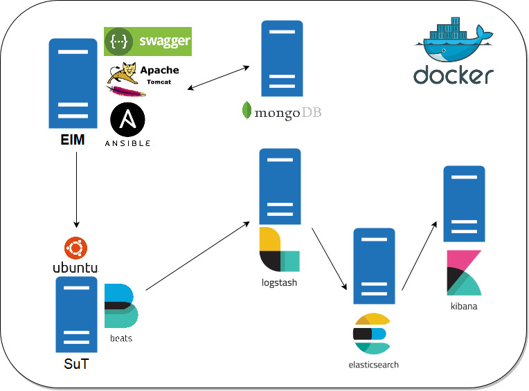

# Elastest Instrumentation Manager
The ElasTest Instrumentation Manager (EIM) component controls and orchestrates the Instrumentation Agents that are deployed in [ElasTest] platform. These agents will instrument the operating system kernel of the SuT (Software under test) host instances. Thanks to it, the agent will be capable of exposing two types of capabilities: 
1) Controllability, through which the agent can force custom behaviours on the host’s network, CPU utilization, memory consumption, process lifecycle management or system shutdown, etc.
2) Observability, through which the Agent collects all information relevant for testing or monitoring purposes (e.g. energy consumption, resources utilization, etc.)

Before you start using ElasTest, you need to know the following terms:

- **SuT (System under Test):** Specification of the System that is being tested for correct operation.

## Features
The version 0.1 of the EIM, provides the following features:

- Register new Instrumentation Agent. 
- Deploy [Beats](https://www.elastic.co/products/beats) software over the SuT.  

>**Note:** All tests has been done using ubuntu14.04 as operating system.

## How to run
To start using EIM, you need to follow the next steps. Several of these steps, are specific for Windows or Linux Operating Systems.

### Windows 
1.  Install [Docker Toolbox for windows](https://docs.docker.com/toolbox/toolbox_install_windows/).
Start Boo2docker Virtual Machine from Virtual Box GUI and connect via ssh. Execute `docker-machine ssh` from power shell or any terminal emulator. 
2.  Install [Docker Compose](https://docs.docker.com/compose/install/.) on the Virtual Machine Boot2docker created by Docker Toolbox installation. 
    - `sudo -i` (get access as superuser)    
    - ``curl -L https://github.com/docker/compose/releases/download/1.14.0/docker-compose-`uname -s`-`uname -m` > /usr/local/bin/docker-compose``
    - `chmod +x /usr/local/bin/docker-compose` 

3. Elasticsearch requires an increase of the max virtual memory to at least 262144 `sudo sysctl -w vm.max_map_count=262144`
4. Install [GIT](https://www.atlassian.com/git/tutorials/install-git) 

>**Note:** To this day, for each time the docker machine reboots, you will have to repeat the steps 2 and 3.

### Linux 
1. Install [Docker](https://docs.docker.com/engine/installation/).  
2. Install [Docker Compose](https://docs.docker.com/compose/install/).
    - `sudo -i` (get access as superuser)  
    - ``curl -L https://github.com/docker/compose/releases/download/1.14.0/docker-compose-`uname -s`-`uname -m` > /usr/local/bin/docker-compose``
    - `chmod +x /usr/local/bin/docker-compose` 

    > **Note:** For use Docker Compose file Version 2.1 you need Docker Engine version 1.12.0+ and Compose 1.9.0+.
    
3. Elasticsearch requires an increase of the max virtual memory to at least 262144. 
    - `sudo sysctl -w vm.max_map_count=262144`

4. Reload configuration.
    - `systemctl daemon-reload`
    
5. Install [GIT](https://www.atlassian.com/git/tutorials/install-git) 

### Download EIM
- Clone the project:
`git clone https://github.com/elastest/elastest-instrumentation-manager.git`
If you do not have git installed, you can also download the zip file from GithHub
 
### Start and stop EIM
- `cd elastest-instrumentation-manager`
- `docker-compose -p eim up `
- To stop EIM press `Ctrl+C` in the shell

## Basic usage

Let's go into detail with all the available features that EIM can be done

> **Note:** All the examples provided below, the ip address that are used, are the ones generated by this specific docker-compose environment, but please check in your own environment the real ip you need in each case. You can get the ip address using the `ifconfig -a` command

### Register new Instrumentation Agent
EIM is able to register new Instrumentation Agent received from REST API exposed, to do this, the SuT host that will be added must have the SSH public key of the EIM in `/root/.ssh/authorized_keys` file, in order that *elastest* user can execute actions in this Sut host.

#### SuT Prerequisites
A. *elastest* user created with *elastest* password:
- create the user: `useradd -ms /bin/bash elastest`
- add the user to sudo group: `usermod -aG sudo elastest`
- set elastest as password: `echo "elastest:elastest" | chpasswd`

B. SSH server up and running:
- install SSH server: `apt-get -y install openssh-server && apt-get -y install apt-transport-https`
- start service: `service ssh start`

#### Step by step 
1. Log into EIM's container: `docker exec -it eim_eim_1 /bin/bash`
2. Connect to SuT host with SSH command: `ssh -oStrictHostKeyChecking=no root@<sut_ip_address>`. If this command is not executed, the EIM will not be able to connect with SuT because of host key issue.
3. Get the SSH public key from EIM using the REST API call doing a `GET` to `http://localhost:8080/eim/api/publickey`. Get the SSH public key and paste it, inside `/root/.ssh/authorized_keys` file in SuT.
4. Using the REST API execute a `POST`to `http://localhost:8080/eim/api/agent` and sending as body request the information about new host:
`{"address": "172.21.0.6"}`. The call to the API must has as headers: `Accept: application/json, Content-Type: application/json`
5. If everything works fine, the information about new agent is returned:
`{"agentId":"iagent1","host":"172.21.0.6","monitored":false}`
6. Log file available: `/var/log/eim` with this format `/var/log/eim/ssh_<agentId>_<execution_date>`
7. Files executed available in `/var/ansible/ssh`
8. Check that the new agent is created in mongoDB database `eim` in table `agent`. For this task, [Robomongo](https://robomongo.org/) is a good choice. The database connection details is `http://localhost:27017/`
    
### Deploy Beats over the SuT
The EIM is able to deploy the following Beats using the Instrumentation agents created in SuT:
- [Packetbeat](https://www.elastic.co/products/beats/packetbeat)
- [Filebeat](https://www.elastic.co/products/beats/filebeat)
- [Topbeat](https://www.elastic.co/products/beats/topbeat)

#### Step by step 
1. The agent must be registered on EIM (previous feature)
2. Using the REST API execute a `POST`to `http://localhost:8080/eim/api/agent/<agentId>/monitor`. The call to the API must has as headers: `Accept: application/json, Content-Type: application/json`.
> **Note:** The installation time depends of the number of packets to download and install, and also the bandwith and the latency to repositories.
3. If everything works fine, the information about new agent is returned:
`{"agentId":"iagent1","host":"172.21.0.6","monitored":true}`
> **Note:** Using the data from previous example
4. Log file available: `/var/log/eim` with this format `/var/log/eim/beats_<agentId>_<execution_date>`
5. Files executed available in `/var/ansible/beats`
6. Check that Beats data are received by Logstash (in the shell that appears the messages of all containers deployed)
7. Check that Beats data can be also shown in kibana(http://localhost:5601/app/kibana)

## Development documentation

### Architecture
The ElasTest Instrumentation Manager Platform is divided in two parts:
- EIM Server Application.
- EIM Platform Services.

In the next diagram, you can to see the ElasTest Instrumentation Manager Components Architecture.



> **Note:** Take in account that when the environment are launched from docker-compose command, the SuT host does not have Beats installed and the EIM does not have any agent registered

#### EIM Server Application.
This application is the EIM backend that provides a REST API in order to interact the EIM with the ElasTest Instrumentation Agents deployed in the SuT. It is a Java Application developed with [JAX-RS](https://github.com/jax-rs), that uses [Ansible](https://www.ansible.com/) to automate tasks, in the current version: register new Instrumentation Agents and deploy Beats software over a given SuT

#### EIM Platform Services.
EIM uses several external components to implement the features it offers:

- **[Mongo DB:](https://www.mongodb.com/)** The Database System that uses the EIM to store the persistent data, necessary to manage the Agents.
- **[Elasticsearch:](https://www.elastic.co/products/elasticsearch)** As indicated on its website *"is a distributed, RESTful search and analytics engine capable of solving a growing number of use cases. As the heart of the Elastic Stack, it centrally stores your data "*.
- **[Logstash:](https://www.elastic.co/products/logstash)** As indicated on its website *"It is a server-side data processing pipeline that ingests data from a multitude of sources simultaneously, transforms it, and then sends it to your favorite *stash*"*. EIM uses it to gather and parse logs and metrics produced in the SuT where Beats are deployed. The logs and metrics are sent to Elasticsearch.
- **[Kibana:](https://www.elastic.co/products/kibana)** As indicated on its website *"Kibana lets you visualize your Elasticsearch data and navigate the Elastic Stack *". EIM uses it to visualize the data collected from Beats from SuT.
- **SuT:** In order to provide something to test with, a ubuntu14.04 container is provided to interact with EIM Server Application.

### Prepare development environment

First, be sure you can execute EIM in production as specified in section [How to run].

Then, install the following development tools:
- [Java JDK 7](http://www.oracle.com/technetwork/java/javase/downloads/java-archive-downloads-javase7-521261.html)
- [Maven 3.5.0](https://maven.apache.org/download.cgi)
- [Eclipse IDE](https://eclipse.org/ide/) or similar for Java development.

Last, clone the repository in a local folder (for example, `/git`):

```
cd /git
git clone https://github.com/elastest/elastest-instrumentation-manager
```

> **Note:** In windows, only folders within `C:\Users\` can be used inside Docker VM. If you clone the git repository outside of `C:\Users\`, then you need to share git folder with the VM in VirtualBox interface following [these instructions](http://support.divio.com/local-development/docker/how-to-use-a-directory-outside-cusers-with-docker-toolbox-on-windows).


