# ElasTest Instrumentation Manager (EIM): User Guide

## Introduction
EIM is integrated with the ElasTest dashboard and allows to instrumentalize and de-instrumentalize the deployed SuTs. TJobs can also executed to verify that the SuTs are successfully instrumentalized.

#### Prerequisites
1. You need to create a project in ElasTest platform, follow these [steps](https://github.com/elastest/elastest-torm/blob/master/docs/index.md#create-a-project) please
2. You need to create a SuT deployed outside ElasTest.  
  2.1. You can deploy a valid SuT with the docker command: `docker run -itd --network=elastest_elastest --name=eim-sut elastest/eim-sut` 
  2.2. From deployed SuT you need: 
     2.2.1. User: `root` for the proposed SuT &nbsp;&nbsp;&nbsp;
     2.2.2. IP address: you can obtain it executing: `docker exec -it eim-sut ifconfig`. The inet addr value for eth0 interface. &nbsp;&nbsp;&nbsp;
     2.2.3. Private key: you can obtain it executing: `docker exec -it eim-sut cat /root/.ssh/id_rsa`. 
3. You need to add the created SuT to the created project in ETM, to do this click on `New SuT` button inside the created project and the form to create a new SuT will appear. The following data is required:
  3.1. SuT name  
  3.2. SuT description  
  3.3. Select Deployed outside ElasTest and Instrumented by ElasTest radio buttons  
  3.4. SuT IP 
  3.5. User: `root` for the proposed SuT 
  3.6. Private key: the result of the 2.2.3 command 
  3.7. Logs paths: the paths you want to monitorize the changes that is going to happen in these files. You can add more paths to monitor, clicking on the `Add Logs Path` button  . You can use `"/tmp/date.log"` for the proposed SuT because the SuT has a running process that every 10 seconds publish the current date in this path (the file always has one line in order to avoid a huge filesize).
  When you finish to complete all the required fields, click on `Save` button at the bottom of the form
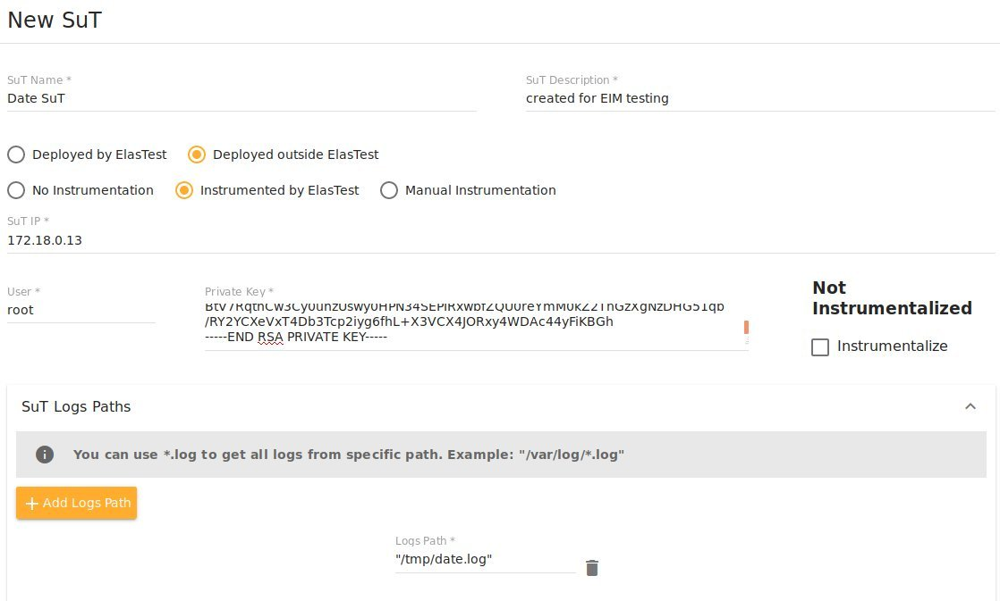 

## Instrumentalize SuT
After completing the Prerequisites, you can Instrumentalize the SuT that you created before. To do this, you have to Edit it, clicking on the pencil (marked in red) in the list of SuTs:
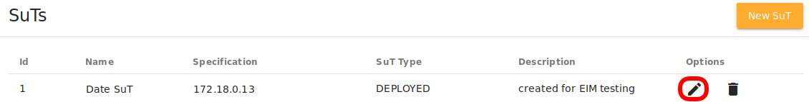 

The SuT information is displayed, you have to click on the `Instrumentalize` check button and save changes:
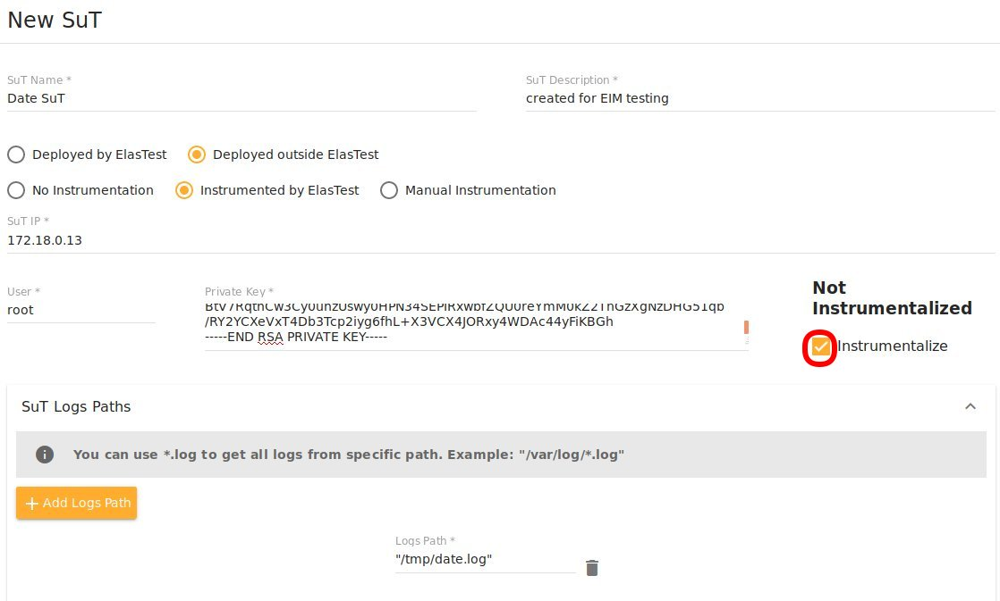 

This operation launches two processes from ETM to EIM:
1. Register the instrumentation agent, in order that EIM will be able to instrumentalize the SuT.
2. Installation of [Beats](https://www.elastic.co/products/beats), a monitoring software to capture metrics from SuT. The installed beats are:
- [Packetbeat](https://www.elastic.co/guide/en/beats/packetbeat/5.6/packetbeat-overview.html)
- [Filebeat](https://www.elastic.co/guide/en/beats/filebeat/5.6/filebeat-overview.html)
- [Metricbeat](https://www.elastic.co/guide/en/beats/metricbeat/5.6/metricbeat-overview.html)

You can follow the progress of both operations looking at the EIM log:  
a. Connect to EIM: `docker exec -it elastest_eim_1 /bin/bash` 
b. Execute: `tail -f /var/log/tomcat7/eim-rest-api.log` 
The operations are finished when the EIM returns the message that SuT is monitored: `{"agentId":"iagent1","host":"172.21.0.13","monitored":true,"logstash_ip":"172.21.0.8","logstash_port":"5044"}`

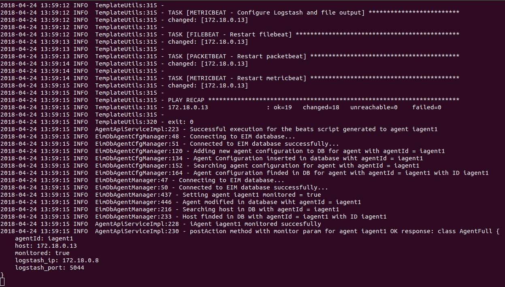 

When you have your SuT instrumentalized you can run TJobs to test it

### Create TJob
Click on `New TJob` button inside the created project and the form to create a new TJob will appear. You can use the following data to create a TJob to test the SuT that you created:
1. TJob Name
2. Select a SuT: you have to select the created SuT in previous steps.
3. Environment docker image: `elastest/test-etm-alpinegitjava`
4. Commands:  
`git clone https://github.com/elastest/demo-projects` 
`cd demo-projects/unit-java-test` 
`mvn -B test` 
5. Uncheck `All-in-one chart` check in Metrics and logs section  
6. Save changes

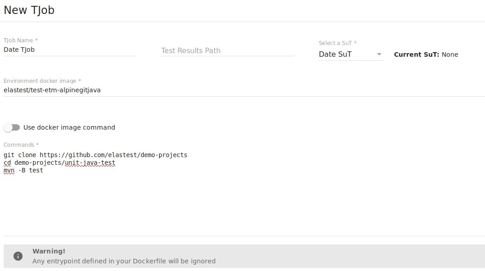 

### Execute TJob
To execute an existing TJob you have to click on `Play` button (marked in red) on Tjob section of the created project:

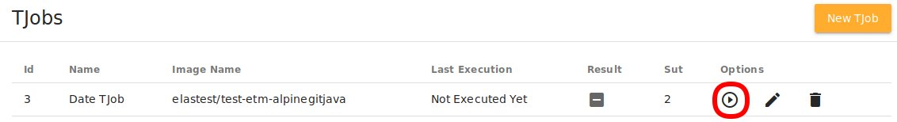 

When the Execution is launched the screen changes to show the execution view, you have to click on the `Open Monitoring Config` button (marked in red):

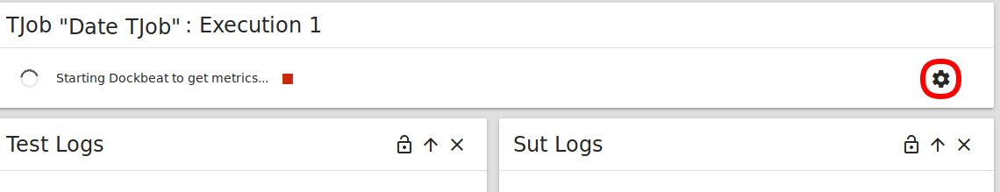  

In the screen that appears, you have to check `sut` (marked in red) on Metrics tree in order that the metrics appears in the execution and click on `Apply and Save` button:

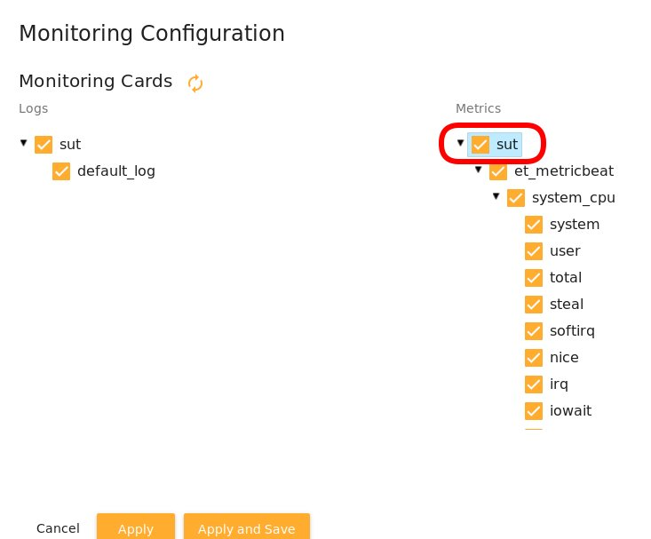 

Then the value of the metrics and the logs captured by the TJob will appear:
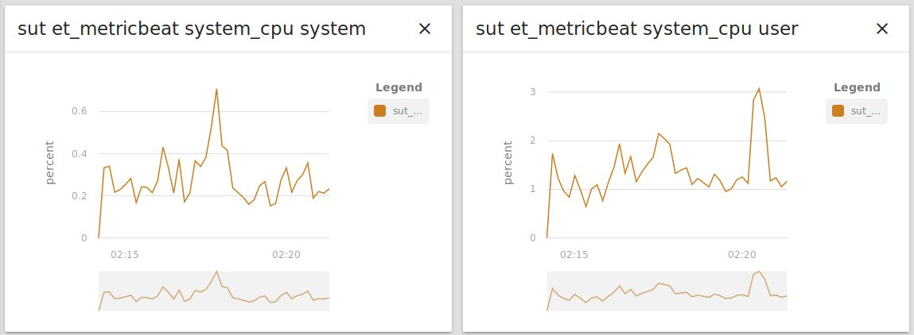  
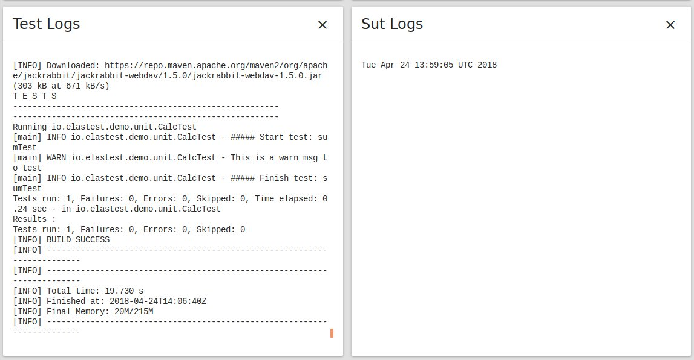 

## De-instrumentalize SuT
You can de-instrumentalize an instrumentalized SuT. To do this, you have to Edit it, clicking on the pencil (marked in red) in the list of SuTs:
 

The SuT information is displayed, you have to click on the `De-Instrumentalize` check button and save changes:
 

This operation launches two processes from ETM to EIM:
1. Uninstall the installed [Beats](https://www.elastic.co/products/beats) ([Packetbeat](https://www.elastic.co/guide/en/beats/packetbeat/5.6/packetbeat-overview.html), [Filebeat](https://www.elastic.co/guide/en/beats/filebeat/5.6/filebeat-overview.html) and [Metricbeat](https://www.elastic.co/guide/en/beats/metricbeat/5.6/metricbeat-overview.html))
2. Unregister of the instrumentation agent

You can follow the progress of both operations looking at the EIM log:  
a. Connect to EIM: `docker exec -it elastest_eim_1 /bin/bash` 
b. Execute: `tail -f /var/log/tomcat7/eim-rest-api.log` 
The operations are finished when the EIM returns the message that SuT is monitored: `{"agentId":"iagent1","deleted":true,}`

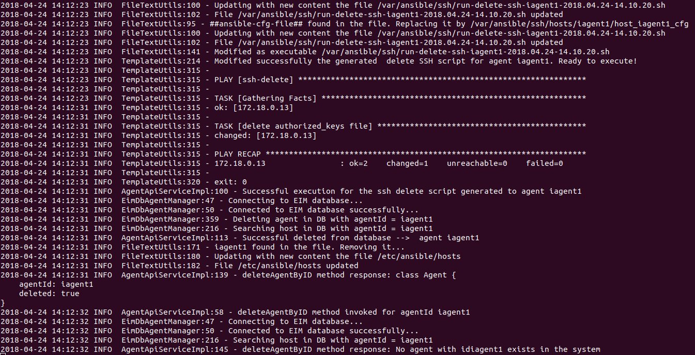 
